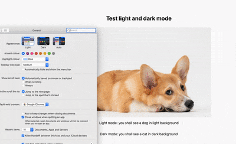

# Test Cypress loading dark mode

This project is made to test cypress loading dark mode. 

## Available Scripts

In the project directory, you can run:

### `yarn start`

Runs the app in the development mode.\
Open [http://localhost:3000](http://localhost:3000) to view it in the browser.

### `npx cypress open`

Launches the test runner. 

## Problems 

### Desired behavior

To easily detect dark mode and light mode, we have specified the light mode to have a picture of dog with light background, and dark mode to have a picture of cat with dark background. 



Currently the dark mode can be loaded in two ways:

- use http://localhost:3000/?darkmode=true to load it manually
- if using mac, go to System Preferences > General > Appearance, change to dark 

Since we want to test when user switches to dark mode on their OS, our darkmode will load properly, we want to mimic this in the browser when cypress runs, so the address should be the same, but dark mode test spec should load dark mode style. 

### Problems 

Currently we're using the code like this:

```
cy.visit('/', {
    onBeforeLoad(win) {
        // eslint-disable-next-line no-console
        console.log('onbeforeload worked');
        cy.stub(win, 'matchMedia')
        .withArgs('(prefers-color-scheme: dark)')
        .returns({
            matches: true,
        })
        .as('dark-media-query');
    },
    });
```
It's not loading the dark mode as expected, but still loading the light mode. 